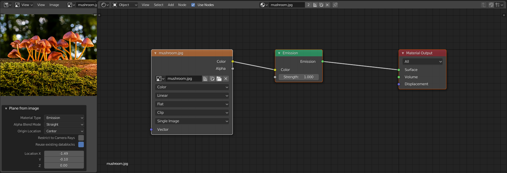
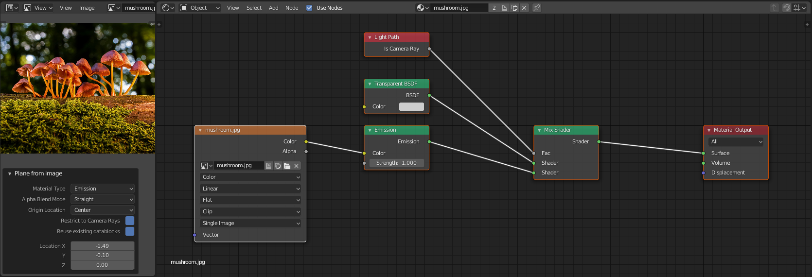
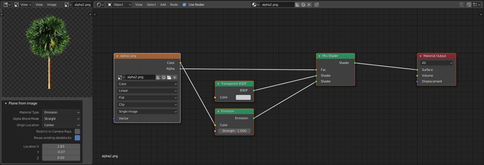
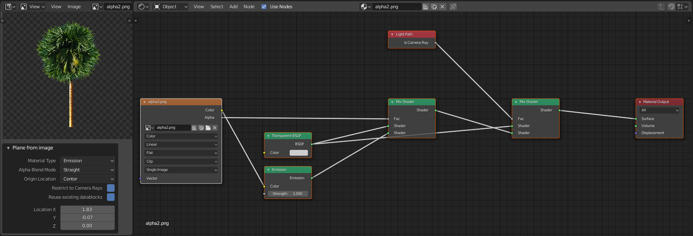

# Import Images as Planes (Re-Write)

This is a rewrite of the import images as planes add-on for Blender 2.8

## Why?
- This was my first ever python script. I should know a lot better how to structure the code now.
- The old script has gotten to be one really huge file. This intends to remedy that.
- The render-engine distinction (Blender Internal -- Cycles) does not matter anymore.
- Also there are many features in one Operator in the old version. The thinking is, that maybe it could be better to give more specialized operators with not as broad a range. The new "Grid Arange" Operator is allready a good example because it is usefull for more than just the image planes.
- Already image-planes can now also be created from image-texture nodes and from the Image-Editor.
- The importer operator should only manage things related to the import
  - Many of these non-import related functions should be better served with seperate operators with the possibility of interaction and redo. The main limitation of the import operator is that the settings have to be known in advance. If e.g. different alignment options are required the planes have to be deleted and re-imported. This can be better handled in the viewport dirctly.
    - No compositing nodes setup
    - no complex distribution of objects in the scene
    - no camera tracking setup

## Mapping old features to the re-write

#### Import Options
- No thoughts yet if and how to bring back.
  - [ ] "Detect Sequences" checkbox seems necessary
  - [x] "relative path" should also be similar to standard "Open image"

#### Compositing Nodes:
- "Setup Corner Pin" should maybe be a secondary operator also?

#### Material Settings:
- No more "use alpha" checkbox
  - uses alpha now based on bit depth of image (24 vs 32)
  - alpha blend mode stays
  - this means alpha is now always autmatically used
- Main Shaders now:
  - Emission
  - Diffuse
  - Principled
  - (easily extensible)
- Old Shadeless converted to checkbox
  - restrict to camera rays works for every material type now
  - not single use case anymore
- Overwrite material renamed
  - "Reuse existing datablock" seems more descriptive

#### Position Settings
The offset planes (when importing multiple images) import option is removed.
For now the new "Grid Arange" Operator is called in this case.
In my estimation this feature does not really belong in the import settings. The distribution is better handled as a second step in the viewport interactively.

New is the Origin Location Option. Either put the origin at the center or at one of the corners.

The Operator now uses the "AddObjectHelper" class which manages position and orientation in the standard way.

#### Plane Dimension Settings
For now the planes are always created with Y-Dimension of 1 with the X-Dimension scaled accordingly. Not really sure if those other options are really benificial.

#### Orientation Settings:
- handled by "AddObjectHelper" now
- "Track Camera" should also be a secondary Operator in the viewport.

## New Operators

#### image import operators
At the moment there are three operators:
- [x] import images as planes
  - the normal importing of images
- [x] plane from image
  - creates an image plane from the image in the image editor
- [x] plane from texture
  - creates an image plane from the selected image texture node in the node editor.

#### Grid Arange
Aranges selected objects in a 2d grid. Has widget to control number of rows. Still needs widgets to controll offsets.

#### Delete unused datablocks
One Operator for deleting (unused) images and one for materials. Mainly for devel. Can be turned off for release. Can also delete all datablocks of type.

## missing Operators
- [ ] Setup Corner pin
  - haven't even ever used that checkbox, need to see what it does
- [ ] Track Camera

## More thoughts
- [ ] maybe add an operator to apply the active image plane to the selected object as a decal
  - add geometry (real and or subsurf modifier)
  - move to surface
  - add shrinkwrap
  - set shading settings for blending in

## Current Shaders
Here are the 4 main shader networks. When the Material Type is changed only the (here Emmission) BSDF Shader is swapped out.
On the Left is the UI in the image editor. Which is nice because the setup can be changed after the fact here and not as with the import only beforehand.

### Standard:

### Standard with restrict to camera:

### Alpha Standard:

### Alpha with restrict to camera:
